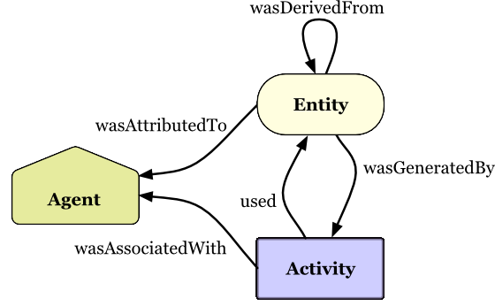
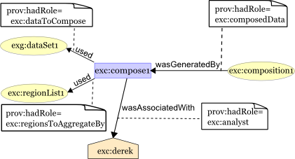

# to install in edit mode

```shell
pip install -e .

```


# Updates

1. we add a PID for every semantic/provenant entity in the platform. 
2. The PID is persistent and is the same for each and every version of the same resource 
3. every resource may be versioned. 


## Summary of the Provenance Ontology


The ontology combines concepts from PROV-O (Provenance Ontology) and MIO, specifically we define

```
@prefix : <http://ddmd.io/mio#> .
@prefix prov: <http://www.w3.org/ns/prov#> .

:Cuds a owl:Class ;
   owl:equivalentClass [ 
       a owl:Class ;
       owl:unionOf (prov:Entity prov:Agent) 
   ] .


```

### Alternatively PROVO can be put under CUDS, and under PROVENANCE class 
This is prefered as it is consistent with the deliverables

```python
from rdflib import RDF, RDFS, Graph
PROV = Namespace("http://www.w3.org/ns/prov#")
CUDS = Namespace("http://ddmd.io/mio#")

PROVENANCE = CUDS.PROVENANCE

g=Graph()
g.add((PROVENANCE, RDF.type, RDFS.Class))

provo_classes = [
    PROV.Entity,
    PROV.Activity,
    PROV.Agent,
]

for _class in provo_classes:
    g.add((_class, RDFS.subClassOf, PROVENANCE))

```


### PROV-O summary

```
PROV-O:

prov:Entity: Represents entities, including different versions of datasets.
prov:Activity: Represents processes or activities that produce new versions.
prov:Agent: Represents agents such as authors or maintainers.
prov:wasGeneratedBy: Links an entity to the activity that generated it.
prov:used: Links an activity to the entity it used.
prov:wasDerivedFrom: Indicates that an entity was derived from another.
prov:wasAttributedTo: Links an entity to the agent responsible for it.
prov:wasAssociatedWith: Links an activity to the agent associated with it.
VO (Versioning Ontology):

vo:Version: Represents different versions of datasets.
vo:successorVersion: Links a version to its immediate successor.
vo:predecessorVersion: Links a version to its immediate predecessor.

```


# From PROV-O Premier and the data model
[PROV-O Premiwe](https://www.w3.org/TR/2013/NOTE-prov-primer-20130430/#intuitive-overview-of-prov)

[the PROV-O Data Model](https://www.w3.org/TR/2013/REC-prov-dm-20130430/)

## Intuitive overview of PROV
This section provides an explanation of the main concepts in PROV. As with the rest of this document, it should be treated as a starting point for understanding the model. The PROV data model document [PROV-DM] provides precise definitions and constraints [PROV-CONSTRAINTS] to be followed.

The following diagram provides a high level overview of the structure of PROV records, limited to some key PROV concepts discussed in this document. Note that because PROV is meant to describe how things were created or delivered, PROV relations are named so they can be used in assertions about the past.



## PROV key concepts overview
### Entities
In PROV, physical, digital, conceptual, or other kinds of thing are called entities. Examples of such entities are a web page, a chart, and a spellchecker. Provenance records can describe the provenance of entities, and an entity’s provenance may refer to many other entities. For example, a document D is an entity whose provenance refers to other entities such as a chart inserted into D, and the dataset that was used to create that chart. Entities may be described as having different attributes and be described from different perspectives. For example, document D as stored in my file system, the second version of document D, and D as an evolving document, are three distinct entities for which we may describe provenance.

### Activities
Activities are how entities come into existence and how their attributes change to become new entities, often making use of previously existing entities to achieve this. They are dynamic aspects of the world, such as actions, processes, etc. For example, if the second version of document D was generated by a translation from the first version of the document in another language, then this translation is an activity.

### Usage and Generation
Activities generate new entities. For example, writing a document brings the document into existence, while revising the document brings a new version into existence. Activities also make use of entities. For example, revising a document to fix spelling mistakes uses the original version of the document as well as a list of corrections. Generation does not always occur at the end of an activity, and an activity may generate entities part-way through. Likewise, usage does not always occur at the beginning of an activity.

### Agents and Responsibility
An agent takes a role in an activity such that the agent can be assigned some degree of responsibility for the activity taking place. An agent can be a person, a piece of software, an inanimate object, an organization, or other entities that may be ascribed responsibility. When an agent has some responsibility for an activity, PROV says the agent was associated with the activity, where several agents may be associated with an activity and vice-versa. Consider a chart displaying some statistics regarding crime rates over time in a linear regression. To represent the provenance of that chart, we could state that the person who created the chart was an agent involved in its creation, and that the software used to create the chart was also an agent involved in that activity. An agent may be acting on behalf of others, e.g. an employee on behalf of their organization, and we can express such chains of responsibility in the provenance.

We can also describe that an entity is attributed to an agent to express the agent's responsibility for that entity, possibly along with other agents. This description can be understood as a shorthand for saying that the agent was responsible for the activity which generated the entity.

One may want to describe the provenance of an agent. For example, an organization responsible for the creation of a report may evolve over time as the report is written as some members leave and others join. To make provenance assertions about an agent in PROV, the agent must be declared explicitly **both as an agent and as an entity**.

### Roles
A role is a description of the **function or the part that an entity played in an activity**. Roles specify the relationship between an entity and an activity, i.e. how the activity used or generated the entity. Roles also specify how agents are involved in an activity, qualifying their participation in the activity or specifying for what aspect of it each agent was responsible. For example, an agent may play the role of "editor" in an activity that uses one entity in the role of "document to be edited" and another in the role of "addition to be made to the document", to generate a further entity in the role of "edited document". **Roles are application specific, so PROV does not define any particular roles.**


### Derivation and Revision
When one entity's existence, content, characteristics and so on are at _least partly_ due to another entity, then we say that the former was _**derived from**_ the latter. For example, one document may contain material copied from another, and a chart was derived from the data that it illustrates.

PROV allows some common, specialized kinds of derivation to be described. For example, a given entity, such as a document, may go through **multiple revisions** over time. Between revisions, one or more attributes of the entity may change. In PROV, _the result of each revision is a new entity_. PROV allows one to relate those entities by making a description that one **was a revision** of another. Another kind of derivation is to say that one entity, a quotation, was quoted from another entity, commonly a document.

### Plans (as in protocols, workflows)
Activities may follow pre-defined procedures, such as **recipes, tutorials, instructions, or workflows**  **(or experimental protocols)**. PROV refers to these, in general, as **plans**, and allows the description that a plan was followed, by agents, in executing an activity.

### Time
Time is often a critical aspect of provenance. PROV allows the timing of significant events to be described, including when an entity was **generated** or **used**, or when an activity **started** and **finished**. For example, the model can be used to describe facts such as when a new version of a document was created (generation time), or when a document was edited (start and end of the editing activity).

### Alternate Entities and Specialization
There is often more than one way to describe something in a record of provenance. Each perspective will be referred to by a separately identified entity, and PROV provides a mechanism for linking the different descriptions of the same thing together through the mechanism of specialization. One entity is a specialization of another entity if it shares the same fixed attributes, with the possible addition of further fixed attributes. This concept is best illustrated through a few use cases.

Entities can be mutable things. For example, a webpage is a single entity, W, despite being edited over time. Each **version** of the webpage is also an **entity**, W1, W2... T**o connect an individual version to the webpage in general, we say that the former is a specialization of the latter:** **W1 is a specialization of W, W2 is a specialization of W, and so on.**

Developer Note: This is quite strange, I do not think a new version is a specialisation, which I prefer to keep in the object oriented manner. 


Two individuals may create provenance referring to the same thing from different perspectives. For example, the author of an article may attribute that article to themselves using PROV while, independently, a reader might quote a fact from that article elsewhere and document this in PROV. If the author later changes the fact, then from the reader's perspective there are now two versions of the article, and the reader had quoted from the version before the change. From the author's perspective, there is a single article, attributed to the author. If the author, the reader, or a third party, were to connect the two PROV records, that party would say that the article as referred to by the reader is a specialization of the same article as referred to by the author.

The above illustrates where we **may want to connect entities by saying that they refer to the same thing**, but at different levels of specialization. PROV also allows us to more generally draw a connection between two descriptions of the same thing, even if not at different levels of specialization, describing the entities as **alternates** of each other. For example, two versions of the webpage above, **W1 and W2, are alternates of each other because they describe the same webpage**.

As another example, if a file is copied from one directory to another to create a backup, we may say that the copies are alternate versions of the same, location-independent, file. Specifically, we may say that the file in the first directory, entity F1, is an alternate of the file in the second directory, entity F2. Note that it is the context (location) rather than content of the file that differs between the entities in this case.


### qualified usage, qualified generation, etc

Note: this is a peculiar way of PROV-O to add some qualified context to the actions and usage etc. It merely c
The provenance can contain more details of exactly how these entities and agents were involved in the activity. To express this, PROV-O refers to qualified usage, qualified generation, etc., which are descriptions consisting of several statements about how usage, generation, etc. took place. For example, we may describe the plan followed by an agent in performing an activity, or the time at which an activity generated an entity, both illustrated later. Another example of qualified involvement is the role an entity played in an activity. The descriptions below state that the composition activity (exc:compose1) included the usage of the government data set (exg:dataset1) in the role of the data to be composed (exc:dataToCompose).

Turtle Example (hide all)
  exc:compose1 prov:qualifiedUsage [
               a prov:Usage ;
               prov:entity  exg:dataset1 ;
               prov:hadRole exc:dataToCompose 
     ] .
    
This can then be distinguished from the same activity's usage of the list of regions because the roles played are different.

Turtle Example (hide all)
  exc:compose1 prov:qualifiedUsage [
                  a prov:Usage ;
                  prov:entity  exc:regionList1 ;
                  prov:hadRole exc:regionsToAggregateBy
     ] .
    
Similarly, the provenance includes descriptions that the same activity was enacted in a particular way by Derek, so it indicates that he had the role of exc:analyst, and that the entity exc:composition1 took the role of the composed data in what the activity generated:

Turtle Example (hide all)
  exc:compose1 prov:qualifiedAssociation [
                  a  prov:Association ;
                  prov:agent    exc:derek ;
                  prov:hadRole  exc:analyst
  ] .
  exc:composition1 prov:qualifiedGeneration [
                      a prov:Generation ;
                      prov:activity  exc:compose1 ;
                      prov:hadRole   exc:composedData
  ] .
    
Depicting the above visually, we have the following.

Provenance graph annotated with roles played by entities and agents





## Complete Example: 


